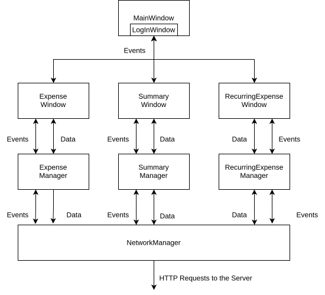

# Finance Manager (Demo)

For a demonstration of the Finance Manager, please visit this project's [github pages] (https://mihael0.github.io/finance_manager_qt/). This is a demonstration of the most recent stable release. This does not mean that it contains the latest feature, but instead it hosts the most current working version of the software.

# Building&Debugging Finance Manager

Currently Finance Manager supports Ubuntu (or Linux based machines) with Qt. 

These are the prerequisits for this project to be buildable/debuggable:
1. Linux (In my case Ubuntu 24.04.2 LTS)
    - Currently the paths in defaults.pri are hardcoded to use linux PWD command.
    - For it to work on windows (for now) you will need to change those to your OS specific slashes.
2. Download and install open source QT [Download] (https://www.qt.io/download-qt-installer)

The steps to build are:

1. Open QT Creator
2. Open Existing Project
3. Open the directory of the project and double click on finance_manager_qt.pro.
4. You should be able to use F5 to build and debug the project.

# Current Architecture
Below you can see the architecture envisioned when designing the project based off the version 1 of the requirements. This is the architecture that guided the application to this point. There is a more detailed explanation of how much is implemented of each block and what it does in docs/CurrentArchitectureInfo.md. In regards to my thoughts on what requires improvements and what is planned for the future in this proejct. Please checkout docs/FutureArchitectureInfo. Everything in this ReadMe is general and not as detailed as in the docs.

